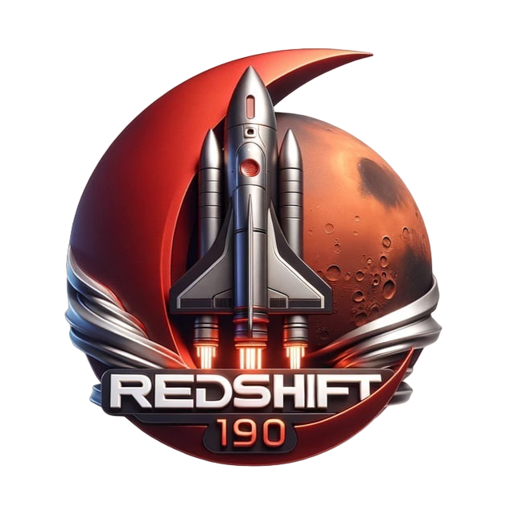
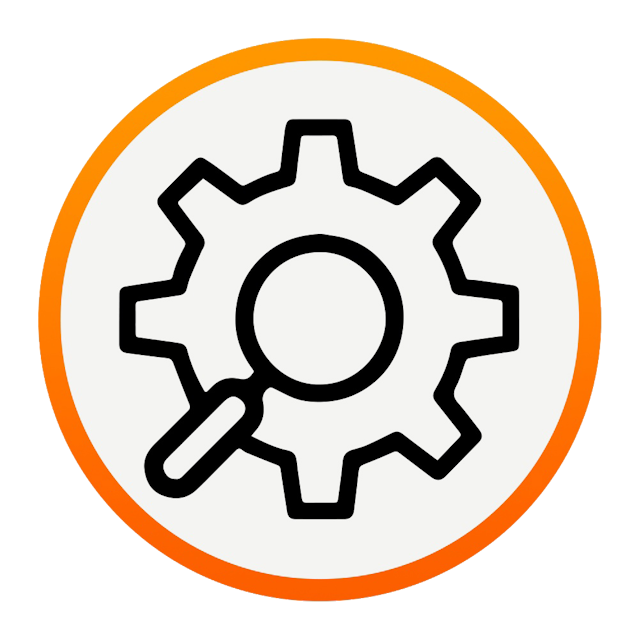

<table>
<tr><td>данные</td><td>данные</td></tr>
</table>

---

В 2023 году исполнилось 90 лет ***Колледжу Программирования и Кибербезопасности РТУ МИРЭА***. Мы - команда энтузиастов в сфере компьютерной безопасности - предлагаем всем желающим погрузиться в фантастическую историю нашего друга и коллеги Егора Сашева - участника первой отечественной миссии по колонизации Марса "RedShift".  
  
Дело в том, что к нам обратились специалисты по компьютерной безопасности из будущего и попросили помочь им в расследовании инцидента, который произошел в их времени. По случайному стечению обстоятельств в этом инциденте, возможно, замешан наш друг. Предлагаем вам провести расследование вместе с нами и узнать, так ли это на самом деле.

---

Конкурс проводится среди студентов высших и средних учебных заведений, осуществляющих подготовку в области информационной безопасности, программирования, системного администрирования, а также специалистов по информационной безопасности государственных и коммерческих компаний в формате индивидуального зачета.  
  
***Цели конкурса***:  
- Повышение уровня теоретических знаний Участников, совершенствование их практических навыков в организации и обеспечении эффективного функционирования систем информационной безопасности.  
- Формирование и закрепление у Участников системно-целостного видения проблем обеспечения информационной безопасности.  
- Подготовка Участников к участию во всероссийских и международных соревнованиях и олимпиадах в области информационной безопасности.

---

***Задание соревнования*** состоит из трех частей:  
1. Написать отчет о расследовании киберинцидента, основываясь на дампах сетевого трафика и памяти целевой инфраструктуры.  
2. Решить задания различных категорий в формате Task-Based CTF.  
3. Восстановить художественную историю произошедших событий.  
  
Решение предоставляется в виде ссылки на отчет

---

***Даты***: 23.12.2023 - 25.12.2023

---

***Организаторами*** соревнований выступают Федеральное государственное бюджетное образовательное учреждение высшего образования «МИРЭА — Российский технологический университет» и Колледж программирования и кибербезопасности РТУ МИРЭА.  

---

***Партнёрами конкурса являются***:  
- ***«Ассоциация руководителей служб информационной безопасности» (АРСИБ)***. Основной целью АРСИБ является содействие развитию информационного общества за счет эффективного использования технологий и средств информационной безопасности во всех сферах деловой и социальной активности.  
- ***АНО Центр развития инновационных технологий «ИТ- Планета»*** — НКО, создающая возможности для самореализации и профессионального роста инженеров, инноваторов и пользователей технологий.  
- ***Похек*** - авторский канал про этичный хакинг, bugbounty, red team, а также про мероприятия в ИБ комьюнити.  
- ***Standoff 365*** — платформа для исследователей безопасности, которая включает в себя киберполигон, багбаунти и митапы.

---

