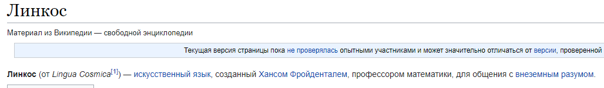

***Описание***: В далёком прошлом, одним математиком, был разработан специальный язык для общения в космосе. Сейчас 2102 год, в преддверии космической миссии SPACESHIFT 169, встал вопрос межвидового общения! Ведь есть свидетельства жизни на далёких звёздах. Это абсолютно новый виток в развитии лингвистики! Каждый астронавт, отправленный в эту опасную миссию должен выучить и знать этот язык. Что это за язык? Флаг - Shift{название_на_латыни}

---

***Решение***:

Гуглим про язык общения в космосе:

В первой ссылке нам попадается "Википедия". В самом начале статьи есть пометка о том, что "***Линкос***" образуется от "***Lingua Cosmica***", что и указывает на флаг

---

***Флаг***: Shift{lingua_cosmica}