***Описание***: Цифровой мир подвергся атаке загадочного кодера, который создал лабиринты кодов для защиты тайного ключа. Тебе предстоит выбрать свой собственный путь через этот виртуальный лабиринт, в котором скрыты различные ветви, ловушки и загадки. Формат флага: Shift{plain_text}

---

***Решение***:

Переместимся сразу в IDA Freeware/Pro. Первым делом стоит обратить внимание на строки, которые лежат в программе (View – Open Subviews – Strings):

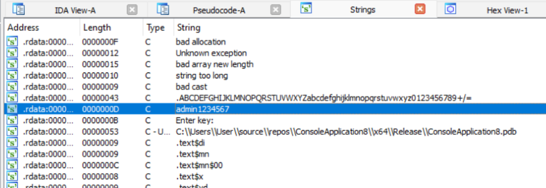

Замечаем 2 интересные строки. Одна из них похожа на своеобразный словарь, вторая очень похожа на пароль. Попробуем ввести в программу вторую строку:

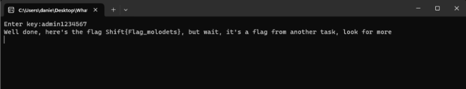

Программа уведомляет нас о том, что данный пароль является неправильным и выдает ложный флаг. Значит нужно искать дальше. В случае ввода любого пароля, мы увидим вывод о неудачной попытке. Ставим брейкпоинты и запускаем дебаг.

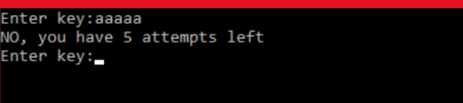

В логическом виде нас направит по зеленой ветке. Что приведет нас в функцию которая отвечает за вывод оставшихся попыток.

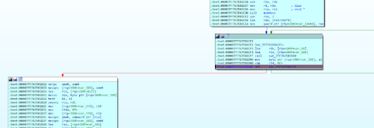

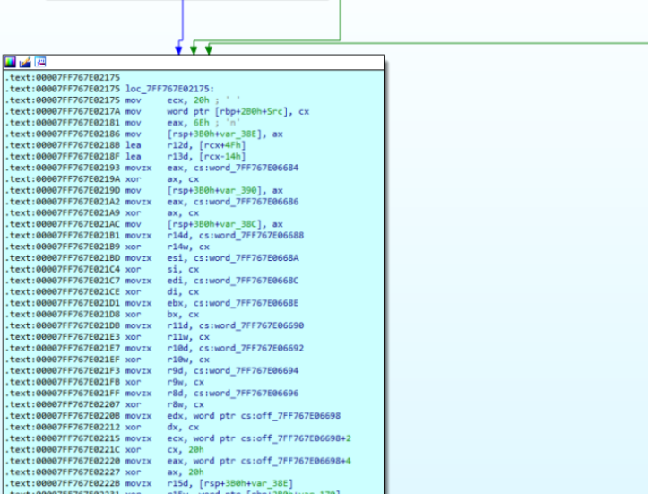

Патчим ***jnz на jz*** и продвигаемся дальше. Перед нами происходит следующая проверка показанная на рисунке ниже.

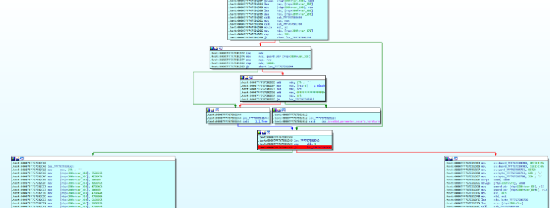

Если перейти на вызов функции показанный ниже, то можно увидеть что речь идет о пароль который мы встретили ранее в string

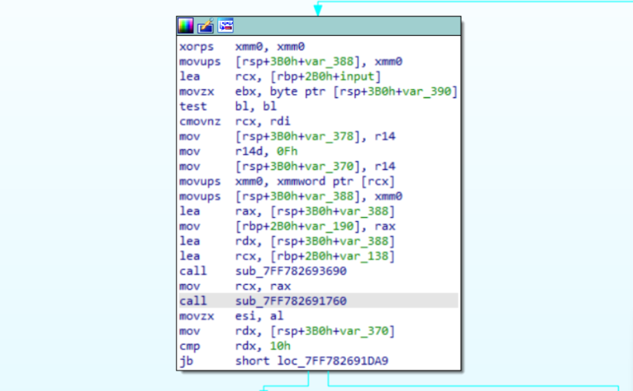

Вот как раз и эта функция

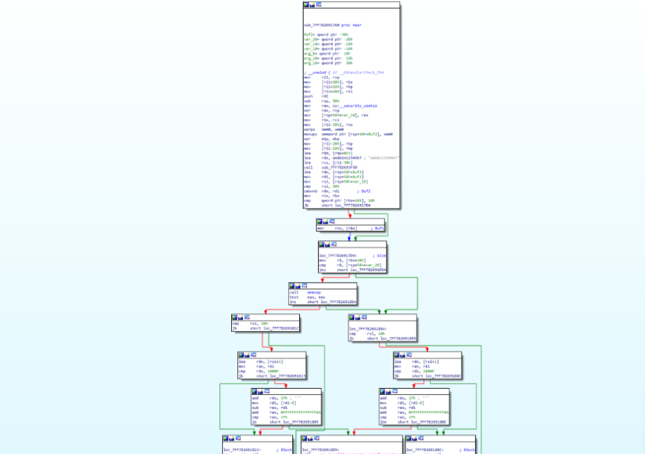

Продвигаемся дальше по красной ветке.

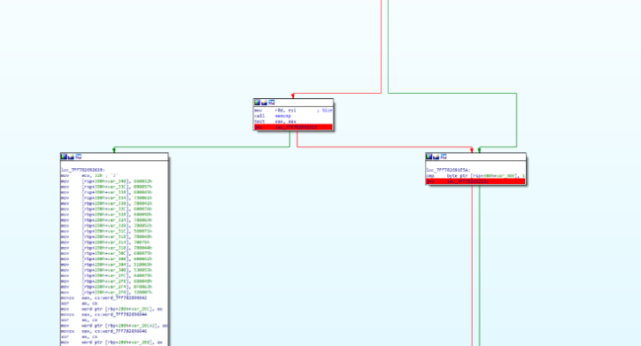

Если открыть эту функцию в псевдо C-коде то увидим, что идет сравнение какой то строки с пользовательским вводом. Если попробовать это как пароль то выведет строку в Base64.

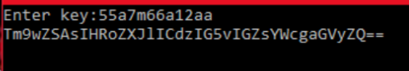

При декодировании выдает не то что нам надо

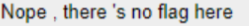

И так как этот пароль нас отправляет по зеленой ветке значит необходимо следовать дальше по красной. Запускаем снова дебаггер, вводим пароль который нам встретился ранее «55a7m66a12aa»

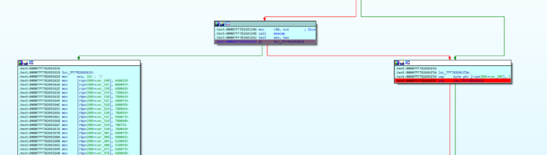

Так как нас введет в лево по зеленой ветке, мы производим операцию которую делали ранее, но тут уже меняем j***z на jnz а затем jnz на jz***. Затем проходим дальше и натыкаемся на очередную проверку хэша и длины

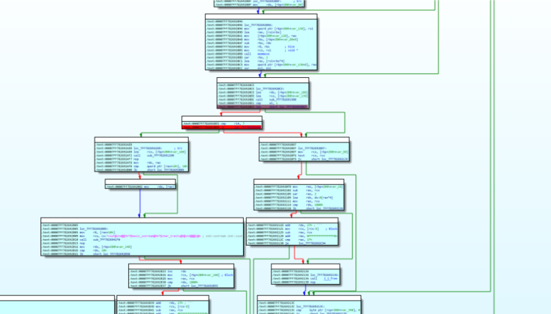

Также патчим и меняем так что бы в функциях проверки нас не отправило в правые функции затем из которых нас бы отправило в функцию отвечающую за вывод оставшихся попыток. Меняем в первом блоке с брейкпоинтом ***jnz на jz***, во втором блоке менять ничего не требуется.

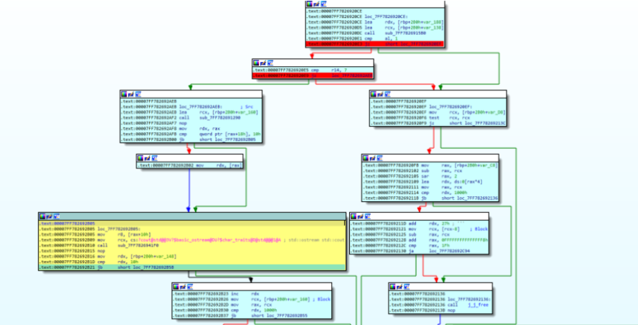

Для райтапа функцию отвечающую за вывод флага я отметил желтым. И осталось продебажить до выводы и мы получаем строку в Base64 которую просто надо декодировать

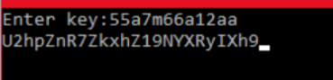

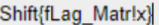

---

***Флаг***: Shift{fLag_Matr!x}