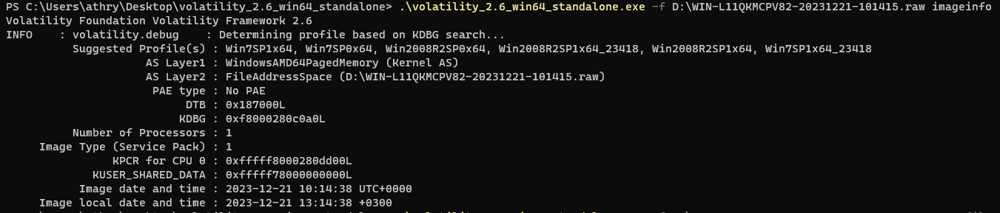
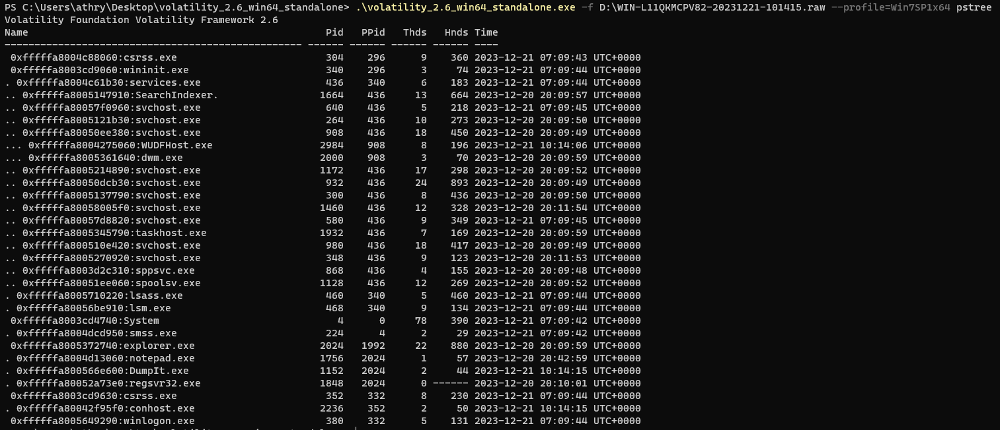
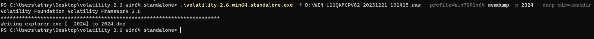
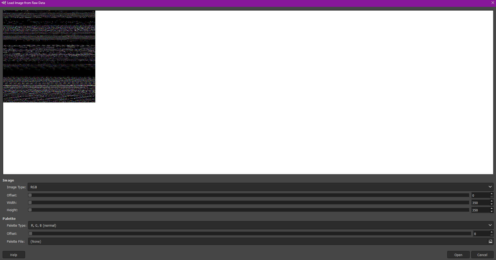
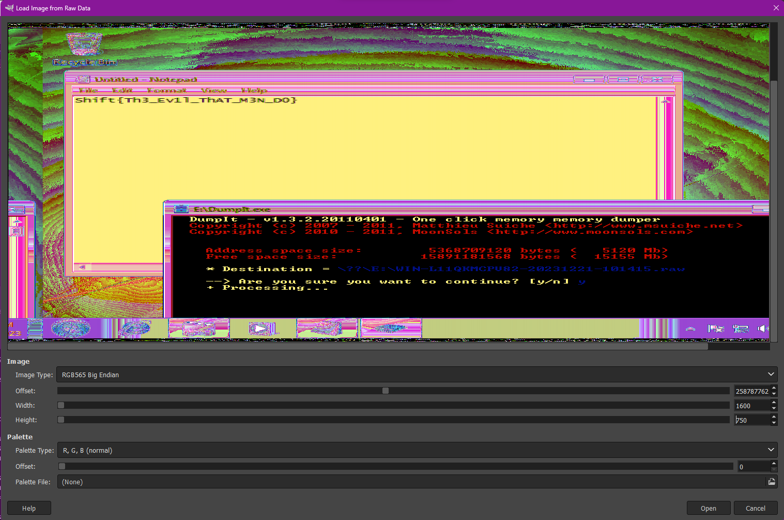

***Описание***: Один нехороший человек натворил делов, и был таким наглым, что даже оставил следы на самом видном месте. Повторяю! На флаг можно ПОСМОТРЕТЬ на самом ВИДНОМ месте. Формат флага: Shift{plain_text}

---

***Решение***:

Для выполнения данного задания мы можем воспользоваться standalone версией [volatility 2.6](https://www.volatilityfoundation.org/releases)

Запускаем volatility, и определяем профиль системы с помощью плагина ***imageinfo***

Узнав профиль - указываем его при помощи ***--profile=подставить_профиль***

Выводим древо процессов командой ***pstree***

И делаем memdumpпроцесса explorer.exe, чей ***pid*** равен ***2024***

Получаем ***2024.dmp***. Сменим его расширение на ***.data***, и откроем его в ***gimp***

Наблюдаем вот такую картину:

И, подобрав параметры - можно найти заветный скрин рабочего стола с флагом

Поздравляю, вы великолепны!

---

***Флаг***: Shift{Th3_Ev1l_ThAT_M3N_D0}