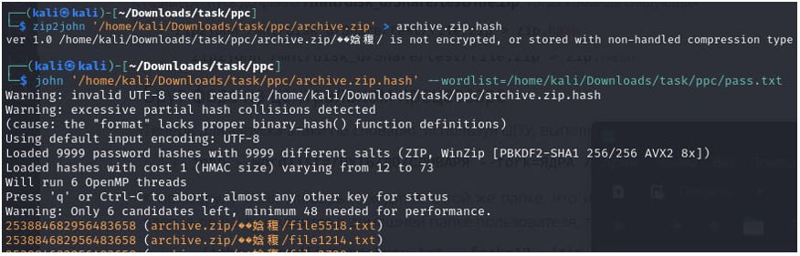

***Описание***: Команда сил цифровой безопасности обнаружила подозрительный батник, согнутый и сплетенный как загадочный кодовый маятник. На первый взгляд он выглядит как лишь неприметный бинарный файл, но под этой маской кроется тайна кибер-взрыва. Формат флага: Shift{plain_text}

---

***Решение***:

Ссылка на для батника деобфускатор: https://github.com/DissectMalware/batch_deobfuscator

Деобфусцированый батник:

С помощью кода на питоне создаем из этих цифр небольшой словарь для брута зипки:

Далее с помощью словаря брутим зипку

После того как нам стали доступны файлы из zip осталось найти среди них флаг. Надо написать код который читает txt файл и записывает те фразы которые не встречались ранее.

Флаг в base64 формате

---

***Флаг***: Shift{Equat0r1al_Gu!nea}