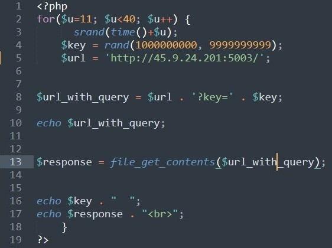
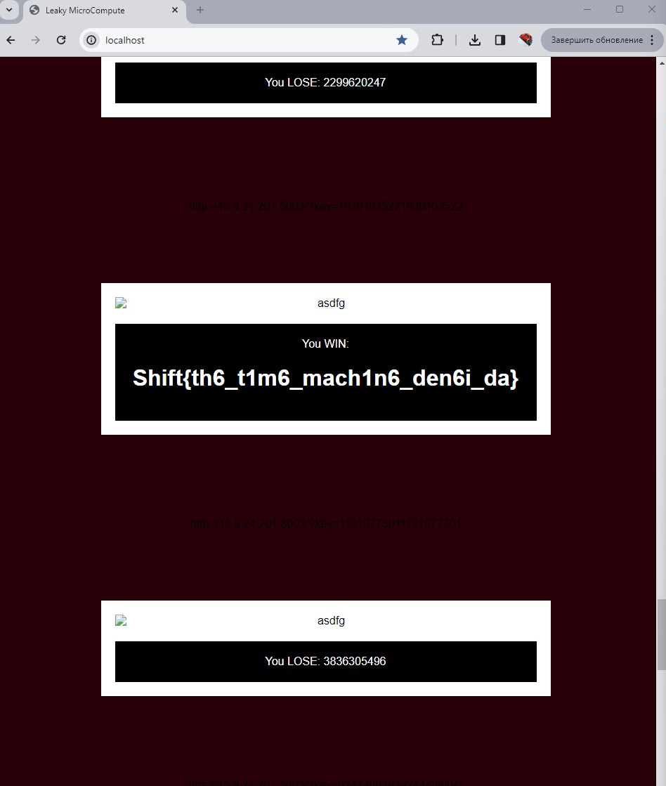

***Описание***: В будущем время - валюта. А где валюта - там и казино, но не каждое казино заботиться о кибербезопасности, вот и утечка кода. Сможешь ли ты забрать выигрыш? Формат флага: Shift{plain_text}

---

***Решение***:

Открыв исходный код замечаем странную строку:

```php
srand(time()+strlen($flag));
```

Погуглив, можно узнать, что данная функция изменяет начальное число генератора псевдослучайных чисел. Так называемый ***seed*** рандома ставится исходя из времени и длины флага. Чтобы узнать серверное время, откроем заголовки которые он отдает, там есть заголовок date, исходя из него можно будет делать расчеты. Исходя из этого нужно получить ***timestamp*** времени отдаваемого сервером, и перебрать длину флага.

Допустим мы получаем ответ с числом ***4584844372***, и с заголовком ***date***: ***Thu, 12 Jan 2023 12:16:17 GMT***

Так как в коде есть ***sleep(1)***, то от ***мс*** нужно отнять ***1***, т.е. нужно получить время с ***12:16:16***

Получаем следующий ***timestamp***: ***1673525776***

Напишем простой код, для перебора:

```php
<?php
for($i=0; $i<50; $i++){
	$server_time = 1673525776;
	srand($server_time + $i);
	$value = rand(1000000000, 9999999999);
	echo $value . ' Len: ' . $i;
	echo "\n";
}
```

Альтернативный вариант решения:



Получаем ответ:

```sh
4886788642 Len: 0
4361941773 Len: 1
5542220176 Len: 2
5874526989 Len: 3
...
4584844372 Len: 26
...
```

Замечаем на длине 26, тот самый ответ.

Имея длину, мы можем получить рандом на будущее время.

Делаем следующий код:

```php
$sec = 10;
$len = 26;
srand(time()+$sec+$len);
$value = rand(1000000000, 9999999999);
echo $value;
```

И получаем число, которое будет сгенерировано через 10 сек, осталось поймать данное число http://flagsharing.ru:5003/?key=XXX

Пример:



---

***Флаг***: Shift{th6_t1m6_mach1n6_den6i_da}