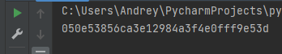
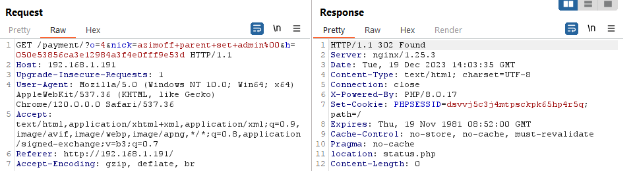
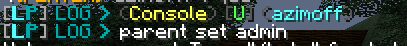
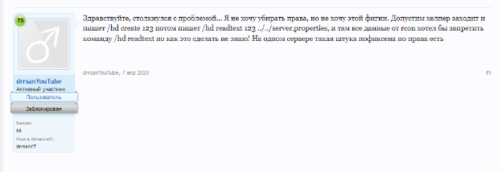

***Описание***: GalacticCraft - это космическое приключение в мире Minecraftia, где тайны скрыты в глубинах кода. Секреты сервера доступны лишь наблюдательным исследователям, способным распознавать скрытые знаки и следы, ведущие к разгадкам. Формат флага: Shift{plain_text}

---

***Решение***:

Заходим на сайт и видим сайт по выдаче доната с одним ***бесплатным товаром*** (***FLY***). Посмотрим исходный код сайта.

Смотрим ***database.sql***:


Замечаем что в команду передается ник. В PHP есть особенность с ***null-byte (%00)***, что часть команды не будет передаваться.

Тут возникает проблема, что в ***buy.php*** стоит фильтр:


Находим костыль в ***payment/index.php***, позволяющий обойти фильтр:


Теперь, чтобы обойти фильтр нужно передать никнейм ***0*** в ***buy.php***, т.к. ***0 = false***, условие перейдет в ***else*** и возьмет ник с ***GET-параметра nick***:


В коде также стоит проверка на ***hash***, но хэш делается просто ***md5(NICK)***:


Пробуем проэксплуатировать:

1. Делаем MD5 хеш




2. Выполняем запрос



3. Выдается админка:



4. Используем уязвимость ***Path Traversal*** в плагине ***HolographicDisplays*** (можно увидеть, что установлена старая версия, при перезаходе):


5. Попробуем поискать уязвимости:




Флаг хранится в FLAG.txt, пробуем его прочитать. Создаем голограмму с любым названием:

```sh
/hd create XXX
```


6. Читаем файл:

```sh
/hd readtext XXX ../../FLAG.txt
```

Получаем флаг:


---

***Флаг***: Shift{It3_M1n6crAft_Trav6rsAl_L0l!}