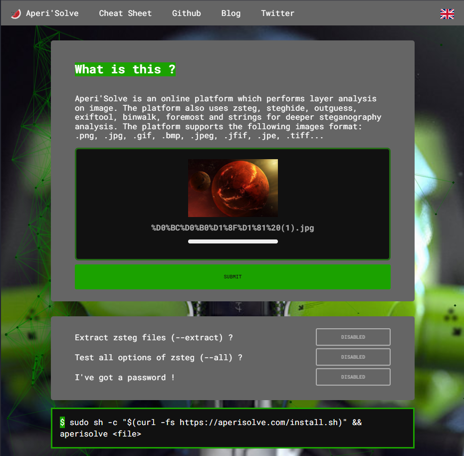
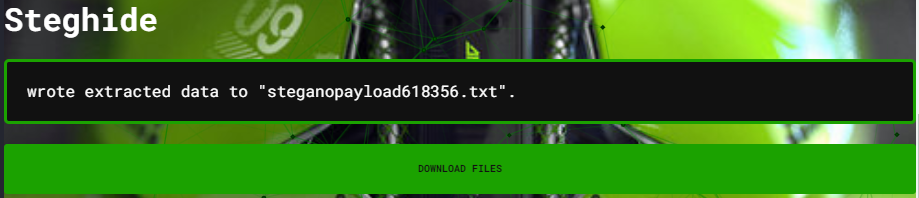
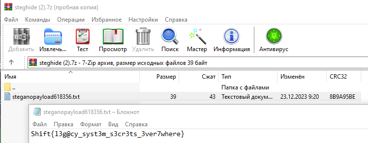

***Описание***: Вы специалист по информационной безопасности из 2023 года, вызванный на помощь в будущее. Ваш инструмент - стеганография, искусство скрытого кодирования. Вам предоставлена картинка, которая, как предполагается, содержит секретные данные. Ваша задача - расшифровать ее. Формат флага: Shift{example}

---

***Решение***:

Перейти на сайт https://aperisolve.com/ и загрузить картинку

Найти пункт Steghide, в нем будет написано wrote extracted data to "steganopayload618356.txt". Нажать "Download files"

Открыть архив и открыть .txt файл в архиве

---

***Флаг***: Shift{l3g@cy_syst3m_s3cr3ts_3ver7where}