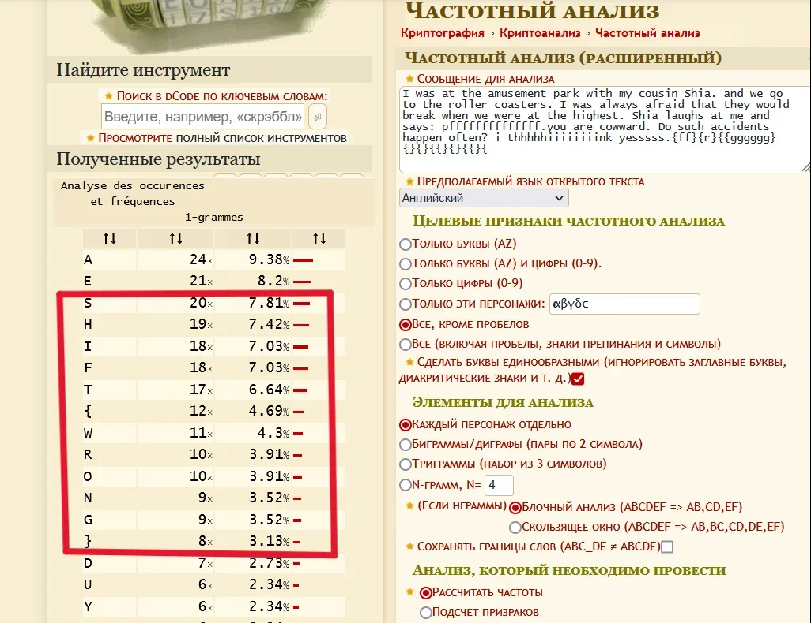

***Описание***: Проведите исследование шифротекста и введите управляющую последовательность. Формат флага: Shift{plain_text}

---

***Решение***:

Шифротекст:

```sh
I was at the amusement park with my cousin Shia. And we go to the roller coasters. I was always afraid that they would break when we were at the highest. Shia laughs at me and says: "pffffffffffffff.You are cowward." Do such accidents happen often? I thhhhhiiiiiiiink yesssss.{ff}{r}{{gggggg}{}{}{{}{}{{}{
```

С помощью ***частотного анализа*** исследуем текст на https://dcode.fr:



---

***Флаг***: Shift{wrong}