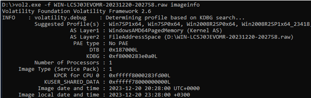
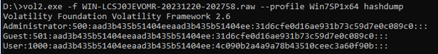
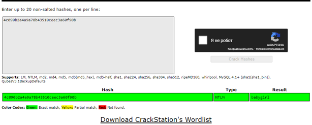

***Описание***: Наши айтишники перенесли компьютер нашего бухгалтера Марины в другую звездную систему, так как она переехала в связи с рождением дочери. После всех радостей этого события она забыла пароль от своей учетной записи. Она перезвонила нам и попросила помочь вспомнить. А у нас остался только этот дамп. ПОМОГИТЕ, МОЛОДЫЕ МАМОЧКИ ОЧЕНЬ ПРИСТАВУЧИЕ!!!

---

***Решение***:

Определяем профиль ОС:

Определяем ***Win7SP1x64***. Используем плагин «***hashdump***» для того, чтобы получить хэши паролей. Обратим внимание на то, что «31d6cfe0d16ae931b73c59d7e0c089c0» представляет собой пустой пароль, а хэш пароля User единственный, который отличается о вышеуказанного, соответственно, проверяем этот хэш любым удобным способом.

> Хэш - 4c090b2a4a9a78b43510ceec3a60f90b

Проверка хэша на CrackStation:

---

***Флаг***: Shift{babygirl}