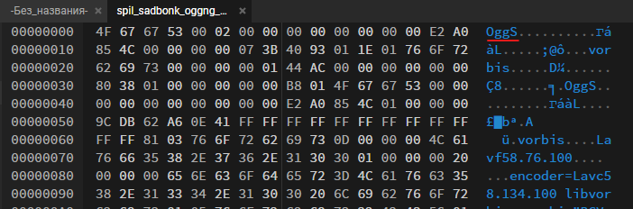

***Описание***: Прямо перед полётом один из наших учёных перехватил сообщения от организации, которая является нашим соперником.

---

***Решение***:

Для начала меняем расширение файла на ***.ogg*** (чтобы это понять, необходимо посмотреть на файл в hex-формате):



Воспроизводим файл и записываем данные:

```sh
76 83 48 116 73 67 48 116 76 83 48 103 76 83 48 103 76 83 48 117 76 83 65 117 73 67 48 117 76 83 52 116 76 105 65 116 76 83 48 103 76 83 52 117 76 83 65 117 76 105 52 103 76 83 52 117 76 83 65 116 76 83 65 116 76 105 52 116 73 67 52 116 76 105 52 103 76 83 52 116 76 105 48 117
```

Переводим в ASCII:

```sh
LS0tIC0tLS0gLS0gLS0uLSAuIC0uLS4tLiAtLS0gLS4uLSAuLi4gLS4uLSAtLSAtLi4tIC4tLi4gLS4tLi0u
```

Переводим из base64: 

```sh
--- ---- -- --.- . -.-.-. --- -..- ... -..- -- -..- .-.. -.-.-.
```

Разворачиваем morse:

```sh
... .... .. ..-. - .-.-.- ... .--. --- .--. .. .--. -.-- .-.-.-
```

Декодим morse:

```sh
SHIFT.SPOPIPY.
```

Меняем точки на {}:

```sh
SHIFT{SPOPIPY}
```

---

***Флаг***: Shift{SPOPIPY}