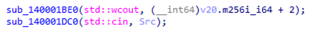
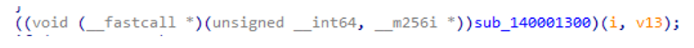
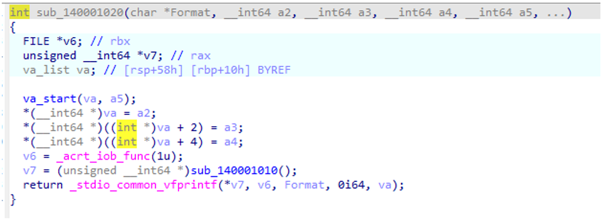
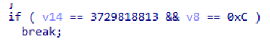
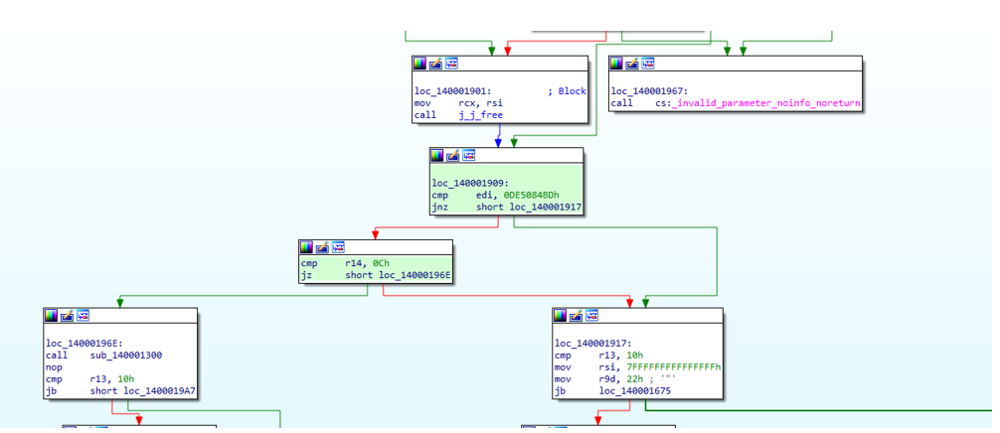
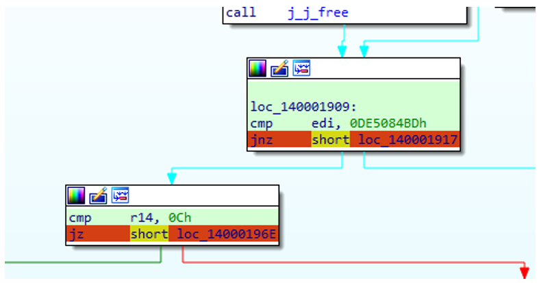
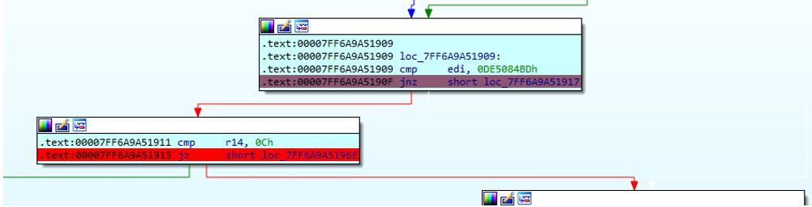
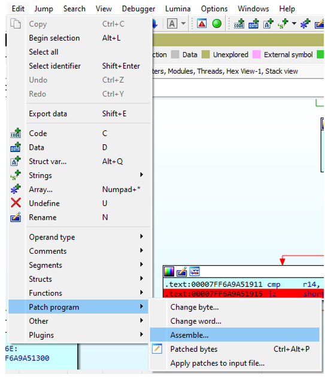
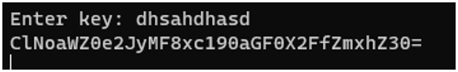
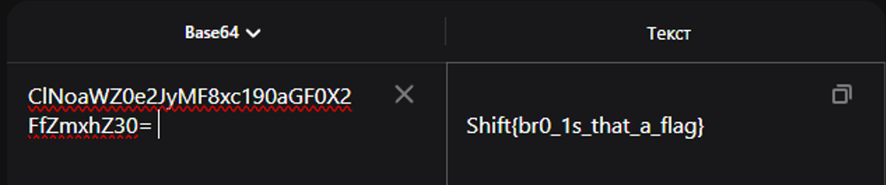

***Описание***: Ты оказываешься в недрах загадочного кода, где в конце лежит очень важная информация, но пароль был утерян от хранилища не мог бы ты помочь достать начинку из пирога. Формат флага: Shift{plain_text}

---

***Решение***:

Так как это таск на реверс – правильнее всего будет воспользоваться IDA Freeware/PRO. Для более быстрого изучения принципа работы программы целесообразно просмотреть псевдокод программы (F5). По следующим строчкам можно понять, где начинается основная часть программы (вывод и ожидание ввода строки):

В самом низу программы можно увидеть, что вызывается функция с параметрами:

Пройдем по ней и увидим, что функция предназначена для зашифровки хранимых данных. В конце программы есть другая функция, перейдем по ней. Понимаем, что функция осуществляет какой-то вывод на экран:

Значит нужно прийти к этому выводу сгенерированной строки. Для этого вернемся в main. Увидим строчку, которая позволяет выйти из цикла проверок while(true):

Свяжем эту строку с дизассемблированным представлением:

Получается, чтобы прийти к выводу сгенерированной строки на экран, нужно изменить условия перехода. Для этого расставим breakpoint’ы на условиях перехода:

Запустим Local Windows Debugger:

В открывшейся консоли нужно ввести произвольную строку, чтобы пройти далее. Следующим шагом на первой точке останова видно, что программа хочет пойти не туда, куда нужно:

А значит нужно изменить поведение программы с помощью:

В первом случае меняем jnz на jz, проходим далее на F9, в следующем меняем jz на jnz. Если все сделано правильно, мы получим строку в консоли:

Расшифровываем строку из base64 в текст и вуаля:

---

***Флаг***: Shift{br0_1s_that_a_flag}