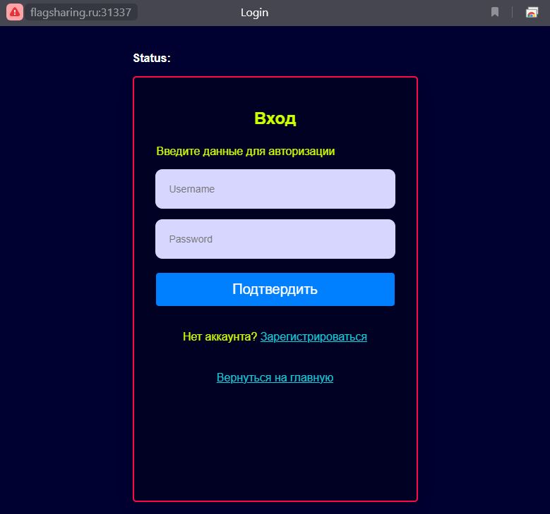
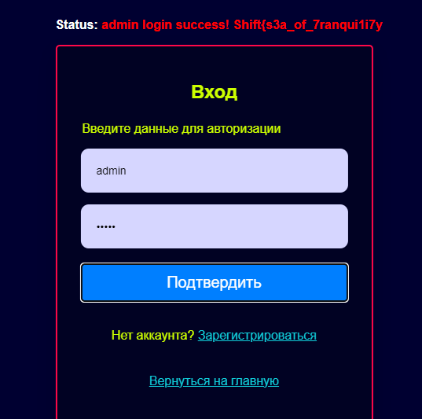
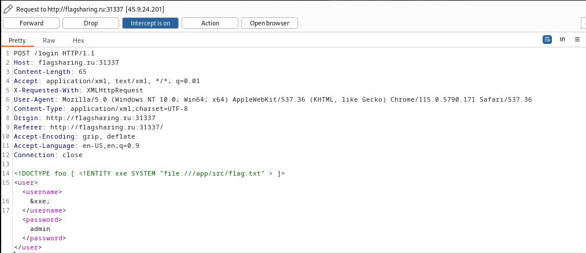
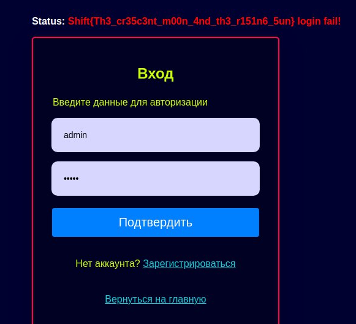

***Описание***: Вот вроде смотришь на сервис, обычный он и ничем не примечательный, даже слишком простой! Но у него странная логика... Как бы мне провалиться внутрь? Формат флага: Shift{plain_text}

---

***Решение***:

Переходим по ссылке http://flagsharing.ru:31337



Попадаем на страницу логина. При этом, мы знаем данные для входа, исходя из выданных нам исходников:

```python
app = Flask(__name__)
app.config['DEBUG'] = True


# sTrOnG CrEdS
USERNAME = 'admin'
PASSWORD = 'admin'


@app.route("/")
def home():
    return render_template("index.html")
```

> Логин и пароль - admin

Логинимся:



Казалось бы, это первая часть флага, но где вторая? Правильно, исследуем исходный код и понимаем, что логин происходит через ***xml***:

```python
@app.route("/login", methods=['POST', 'GET'])
def login():
    result = None
    try:
        tree = etree.fromstring(request.data)

        for child in tree:
            print(child.tag, child.text, child.attrib)
            if child.tag == "username":
                username = child.text
                print(username)
            if child.tag == "password":
                password = child.text
                print(password)

        if username == USERNAME and password == PASSWORD:
            result = "<result><code>%d</code><msg>%s</msg></result>" % (1, username)
        else:
            result = "<result><code>%d</code><msg>%s</msg></result>" % (0, username)
    except Exception as error:
        result = "<result><code>%d</code><msg>%s</msg></result>" % (3, str(error))
	
    return result, {'Content-Type': 'text/xml;charset=UTF-8'}
```

Пробуем реализовать ***XXE*** относительно чтения файлов:



Директорию ***/app/src/*** узнаем из ***docker-compose.yaml***. Учитывая, что **main.py** и **flag.txt** лежат на одном уровне, то ответ практически лежит в ***docker-compose.yaml*** :)

```yaml
version: "1"
services:
  xxe-python-service:
    container_name: EmbeddingAnEntity
    build: .
    command: python /app/src/main.py
    ports:
      - 31337:31337
```



> P.S. Оказывается, первая часть флага, это вовсе не флаг и не его часть...

---

***Флаг***: Shift{Th3_cr35c3nt_m00n_4nd_th3_r151n6_5un}