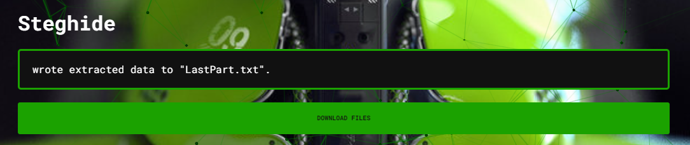
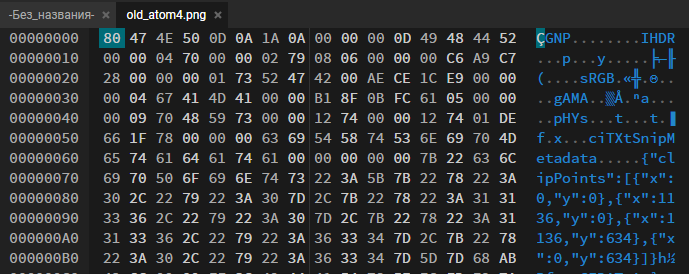

***Описание***: До сих пор все на Земле помнят, что произошло в ночь на 26 апреля 1986 года... Реактор четвертого энергоблока Чернобыльской АЭС разрушился в результате мощного теплового взрыва. Подхваченная ветром радиоактивная пыль частично выпала на территории СССР, оставила очаги излучения в Европе и даже достигла берегов Америки...

---

***Решение***:

В архиве, выданном участникам, есть несколько фотографий и одно видео:

Первая часть флага находится в файле ***old_atom2.png***. Найти эту часть можно, если посмотреть на файл через hex-редактор. Часть флага расположена внизу:

Вторая часть флага находится в файле old_atom5.png, но при этом, чтобы извлечь txt-файл из этой картинки при помощи ***steghide***, мы должны узнать пароль. Его можно получить, открыв видео:

> Password is "shift"

При помощи ***steghide*** на AperiSolve, либо на любом Linux, извлекаем файл ***LastPart.txt*** при помощи найденного пароля:

Хоть и написано, что это последняя часть, это на самом деле не так. Последняя часть находится в ***поврежденном*** файле ***old_atom4.png***. Для того, чтобы восстановить файл, необходимо восстановить первые 4 байта в заголовке файла:

> Байты 80, 47, 4E, 50 меняем на 89, 50, 4E, 47

Вот она, восстановленная картинка:

Если присмотреться, то можно разглядеть последнюю часть флага - 73rrib13_day}

---

***Флаг***: Shift{w3_wi11_a1ways_r3m3mb3r_7his_73rrib13_day}