---

***Предисловие***: Данный стенд был подготовлен в рамках мероприятия "***RedShift190***", которое проводил Колледж программирования и Кибербезопасности.

Авторы: Abends, Athryss

---
### Перечень выданных данных

1) host1.pcapng - файл сетевого дампа с Ubuntu 22.04
2) host2.pcapng - файл сетевого дампа с Windows Server 2012 R2 Standart
3) host3.pcapng - файл сетевого дампа c Windows 10
4) access.log - логи с Apache на Windows 10
5) postgresql-2023-12-18_000000.log - логи с PostgreSQL 15 на Windows 10
6) host2-dump.raw - файл дампа оперативной памяти с Windows Server 2012 R2 Standart
7) Ubuntu.7z - файл дампа жесткого диска Ubuntu 22.04 (внутри vmdk)

Первым делом снимем хэш-суммы с файлов в формате .raw:

| Алгоритм | Файл           | Хэш-сумма |
|:--------:|:--------------:|:---------:|
| MD5      | host2-dump.raw | bdf51c34b894d23875044521c5f11eee |
| SHA256   | host2-dump.raw | 55f408088c9ced21c245aa5b3c395107b74942e7c12f92dd05796ac3971681b2 |
| SHA1     | host2-dump.raw | 15b1c83a8a8c9a5cd963a4660a777043c03e7067 |
| MD5      | Ubuntu.7z      | ad5bfe3c0c3ca2cfea79753e48c5eb8d |
| SHA256   | Ubuntu.7z      | c21fe8f6f6fbf4b5e14ea1346827389878da95612f5677d866739f990214aa79 |
| SHA1     | Ubuntu.7z      | 0ea81967a72ca69565fc66e098ea46da929c434e |

Команда для вычисления хэш-сумм (Windows):

```sh
certutil -hashfile "<имя_файла>" наименовавние_алгоритма
```

---
### Часть 1. Исследование файла host1.pcapng

#### Этап 1. Сканирование хоста 172.80.50.10 на предмет открытых портов

В самом начале файла обнаруживаем непрерывный поток пакетов, связанных с сетевым сканированием хоста 172.80.50.10 со стороны хоста 172.80.50.34. Как это можно подтвердить? Обратим внимание на скриншот:

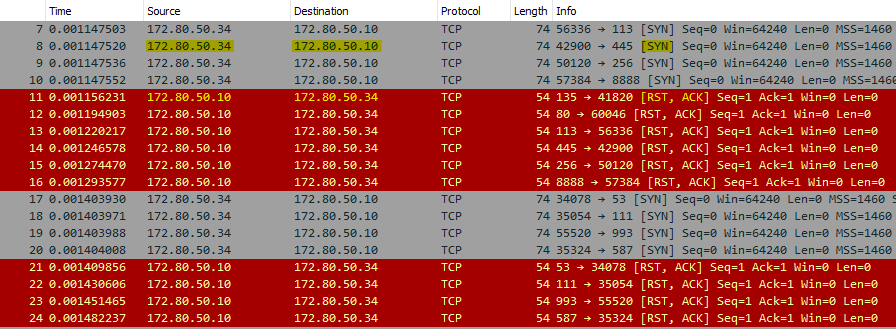

Как можно заметить, инициатор отправки TCP-SYN флагов является хост 172.80.50.34 (см. Source), при этом в ответ он же получает от TCP-RST-ACK флаги от хоста 172.80.50.10, что является свидетельством того, что порт закрыт. Пойдем дальше и посмотрим, что происходит в том, что случае, если порт является открытым. Обращаем внимание на 21 порт:

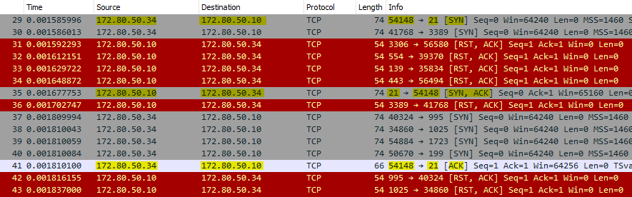

По всей видимости, IP-адрес 172.80.50.34 принадлежит ***атакующему***, т.к. именно он инициализирует все соединения. Возьмем 21 порт. Для начала злоумышленник инициализирует (средствами, предположительно, Nmap) соединение с 21 портом от порта 54148, посылая SYN-флаг. Порт 21, в свою очередь, является открытым, поэтому посылает не TCP-RST-ACK, а TCP-SYN-ACK обратно на порт 54148 тем самым, сообщая о том, что к 21 порту можно подключиться. Далее уже снова относительно порта 54148 прилетает флаг ACK на 21 порт, устанавливая полноценное соединение. Ввиду этого, можно предположить, что злоумышленник применил стандартное (без флагов Nmap) SYN-сканирование (по умолчанию Nmap запускается с флагом -sS в случае, если ему не передали другой флаг для смены типа сканирования). Обозначение данной техники - [TCP SYN scan(-sS)/Stealth Scan](https://shubhams-notes.gitbook.io/nmap/nmap/nmap-tcp-scans)

Основываясь на примере с 21 портом, можно найти и другие открытые порты. Получаем следующие открытые порты: 21, 22, что подтверждает скриншот ниже:

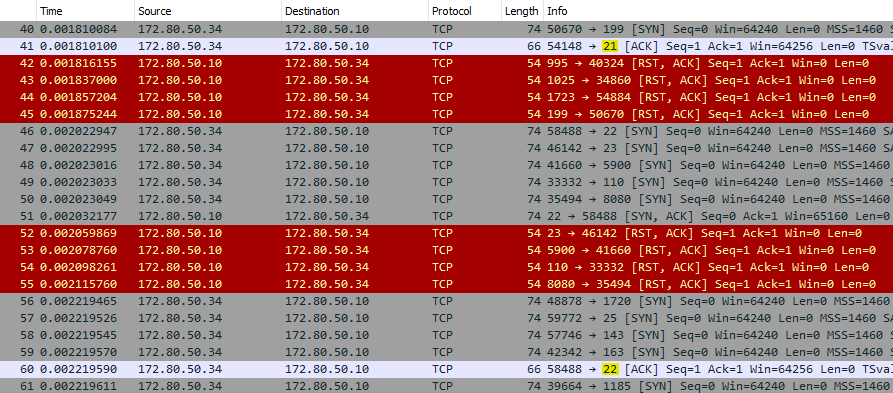

#### Этап 2. Вход на FTP-сервер относительно anonymous, исследование SSH-трафика

Далее находим пакеты, связанные с FTP-трафиком. Сделаем сортировку по протоколам в Wireshark:

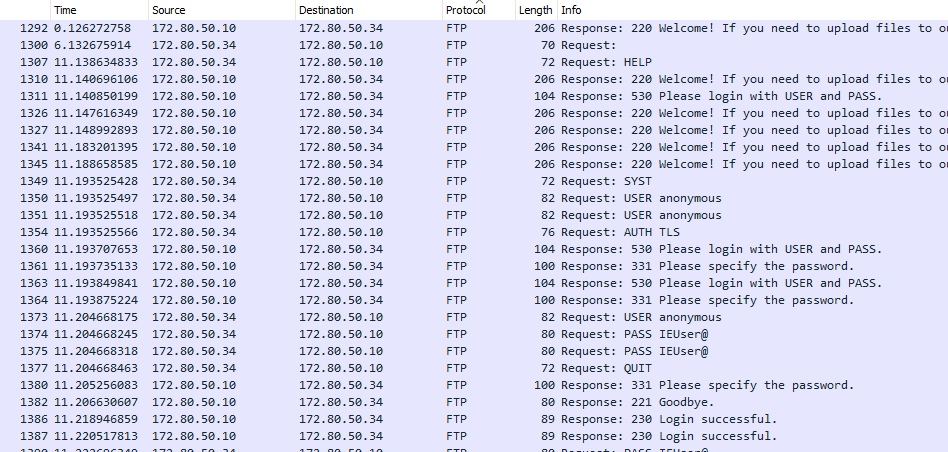

На данный момент нас интересует два вопроса:
1. Под какими учетными данными вошел злоумышленник;
2. Доступ к каким файлам получил злоумышленник;

Ответ на первый вопрос содержится в TCP-потоке под номером 664:

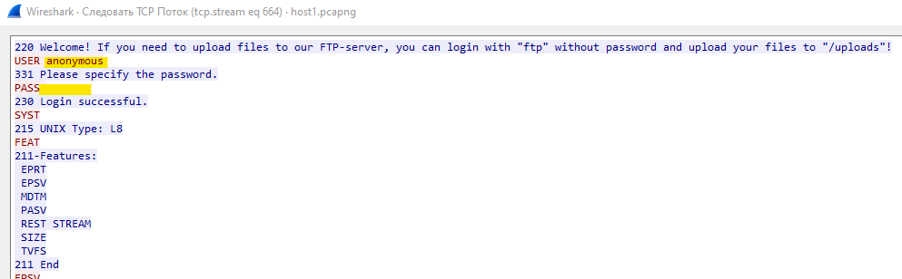

> Фильтр для Wireshark: tcp.stream eq 664 

Список файлов, находящихся на FTP-сервере можно найти в потоке 666:

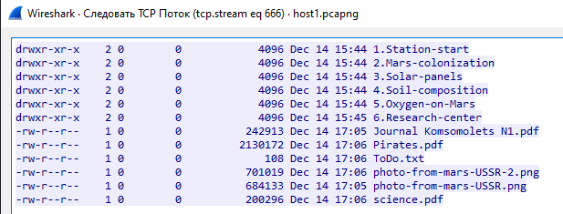

> Фильтр для Wireshark: tcp.stream eq 666

При этом стоит обратить внимание на то, что злоумышленник не скачивал абсолютно все файлы, а только следующие из них:
1. Journal Komsomolets N1.pdf - TCP-поток 668;
2. Pirates.pdf - TCP-поток 669;
3. ToDo.txt - TCP-поток 670;
4. photo-from-mars-USSR-2.png - TCP-поток 673;
5. photo-from-mars-USSR.png - TCP-поток 675;
6. science.pdf - TCP-поток 676;

Все файлы можно извлечь из сетевого дампа для дальнейшего исследования. Сделать это можно довольно просто. Для начала открываем один из вышеперечисленных TCP-потоков (я это сделаю на примере Journal Komsomolets N1.pdf):

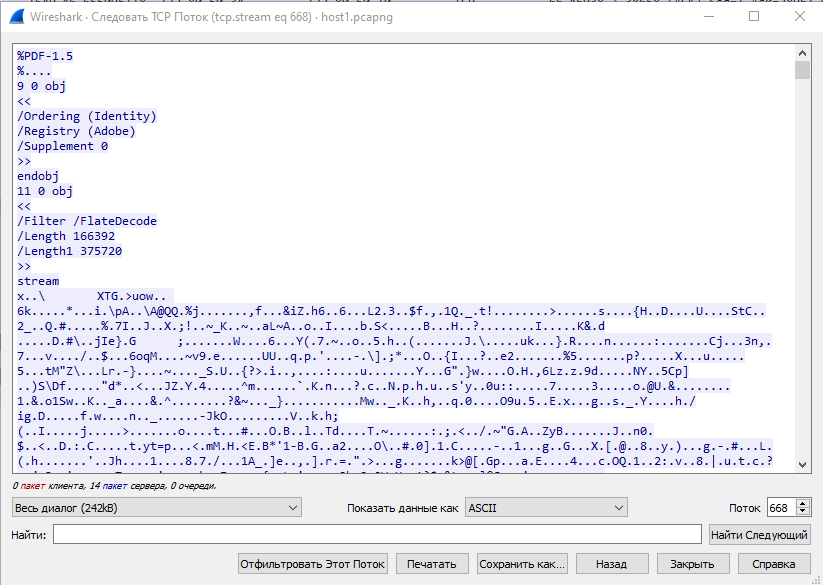

Далее необходимо выбрать "Показать данные как Необработанный":

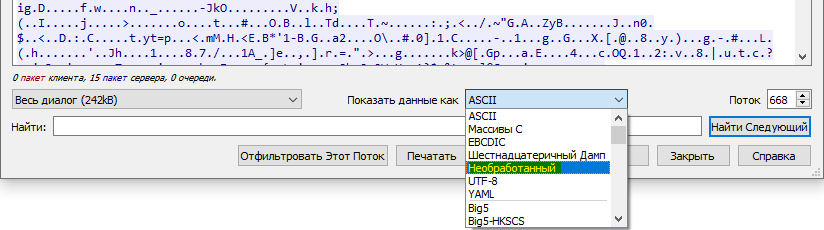

И в конце сохраняем файл через "Сохранить как...":

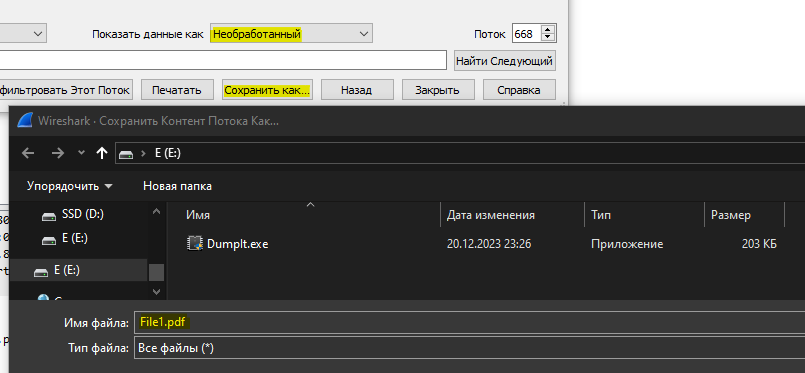

В итоге получаем полноценный восстановленный файл:

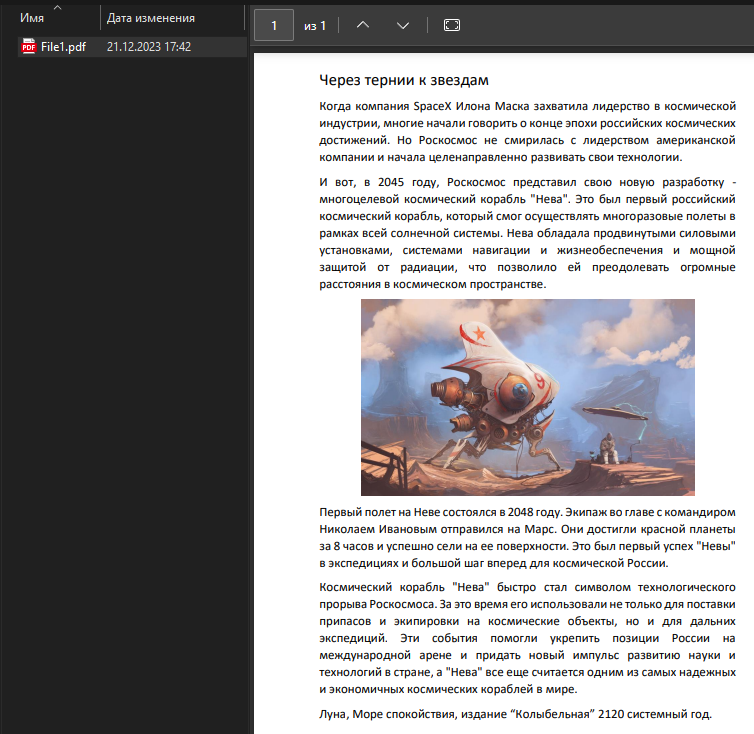

Далее обратим внимание на файл ToDo.txt:

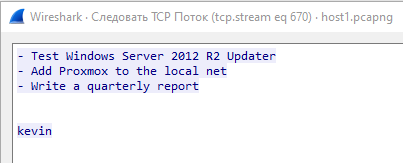

Также заметим, что в pcapng-файле присутствует большой поток SSH-трафика:

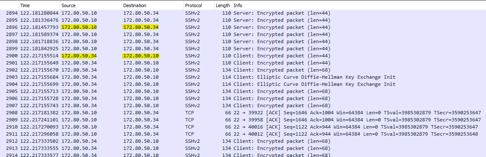

Первоначально, основной поток SSH-трафика проходит между ***атакующим*** (172.80.50.34) и ***жертвой*** (172.80.50.10). На основе этого, а также учитывая все вышеописанные факты, можно сделать вывод о том, что злоумышленник получил доступ по SSH к жертве (172.80.50.10). 

Спустя некоторое количество пакетов видим, что ситуация с SSH-трафиком изменяется. В качестве "Destination" указан другой IP-адрес - 192.168.20.10:

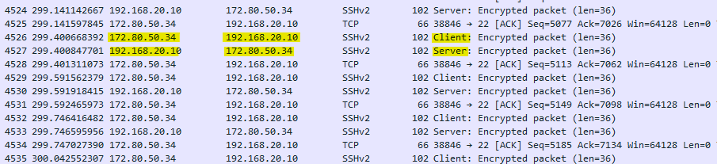

Учитывая, что этот сетевой дамп относится к одной машине, то можно сделать вывод о том, что у исследуемого хоста 2 сетевых интерфейса:
- 172.80.50.10;
- 192.168.20.10;

Здесь нужно взять во внимание факт, связанный с IP-адресами из разных подсетей и SSH-трафиком. Скорее всего, это может нам говорить о возможном наличии SSH-туннеля, но это еще предстоит подтвердить более точно. С этого момента можем считать первый хост скомпрометированным, т.к. злоумышленнику необходимо манипулировать конфигом SSH-сервера, чтобы активировать параметры для проброса портов (SSH-туннелирования)

#### Этап 3. Сканирование второй подсети

Как нам удалось выяснить, злоумышленник, предположительно, полностью или частично захватил первый хост и стал продвигаться дальше. Первоначальный адрес второй подсети, который мы обнаружили - 192.168.20.10. Среди захваченных пакетов обнаруживаем новое сканирование сети от атакующего (172.80.50.34):

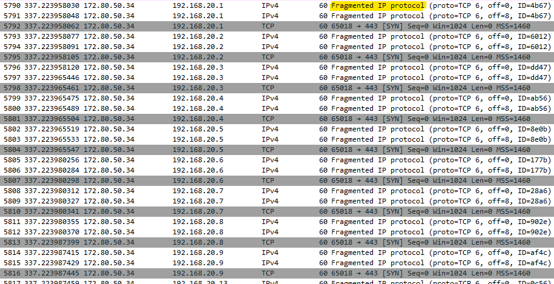

При этом обратим внимание на то, что сканирование происходит именно в рамках подсети 192.168.20.0/24 с целью нахождения новых для злоумышленника хостов. Также обратим внимание на то, что сканирование имеет тип TCP Fragmented Scan (-f)

Судя по всему, злоумышленнику удалось обнаружить 2 живых хоста в рамках подсети 192.168.20.0/24, что можно наблюдать ниже: 

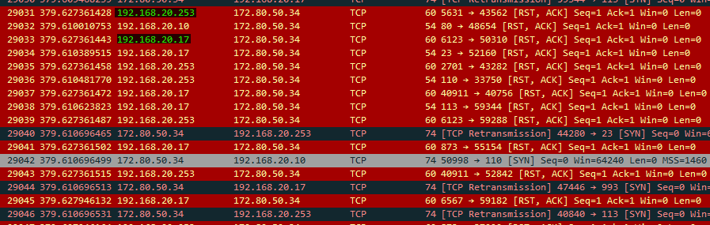

По дампу видно, что присутствует крайне много пакетов со стороны следующих хостов:
1. 192.168.20.253
2. 192.168.20.17

К тому же, по всей видимости, далее злоумышленник сканирует именно два вышеупомянутых хоста (см. по аналогии с примером про 21 порт в самом начале) и находит следующие порты:
1. 192.168.20.17: 80, 135, 139, 443, 445, 5432

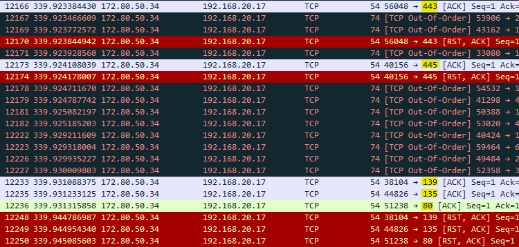

> На скриншоте представлены не все найденные порт, но в дампе они есть, проверено!

2. 192.168.20.253: 53, 88, 135, 139, 389, 445, 464, 593, 636, 3268, 3269, 49152, 49153, 49154, 49155, 49157, 49158, 49159, 49163

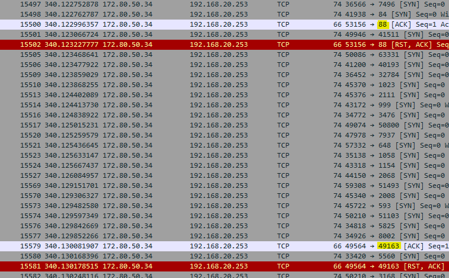

> На скриншоте представлены не все найденные порт, но в дампе они есть, проверено!

Практически в самом конце исследуемого сетевого дампа можно заметить, что злоумышленник обращается по 80 порту на хост 192.168.20.17:

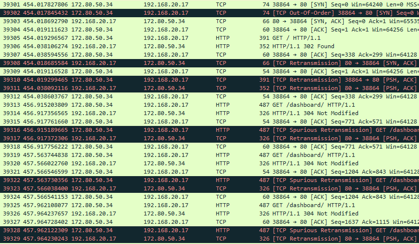

При этом, злоумышленник не смог ничего предпринять, возможно, веб-ресурс не работает, либо недоступен по какой-то другой причине.

#### Этап 4. Доступ до PostgreSQL

В ходе дальнейшего исследования были выявлены несколько попыток подключения к PostgreSQL:

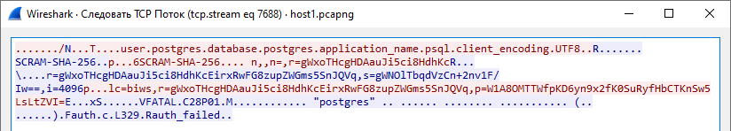

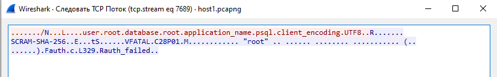

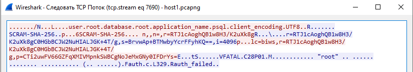

По всей видимости, атакующий не смог подключиться к БД, поэтому исследуем, что было сделано далее.

#### Этап 5. Загрузка ВПО на FTP-сервер

После нескольких попыток подключения к БД, злоумышленник вновь взаимодействует с FTP-сервером


Проследим за потоком №7694:

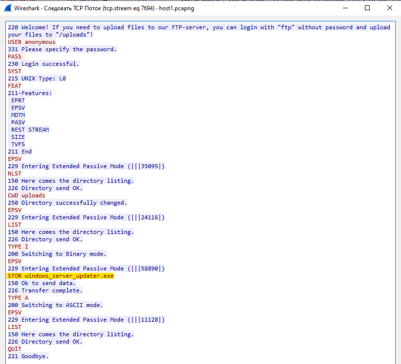

Самое интересное, что злоумышленник загрузил файл на FTP-сервер. Также обратим внимание на его название (***windows_server_updater.exe***), а также вспомним, что в списке дел (***ToDo.txt***) человека с именем ***kevin*** фигурировал пункт с необходимостью установить обновление на Windows Server. Получается, что злоумышленник, скорее всего, подбросил ВПО под видом легитимного ПО. Но так ли это на самом деле еще предстоит разобраться.

Собственно, сам файл можно извлечь как и ранее, перейдя в поток 7697 сохранив необработанные данные:

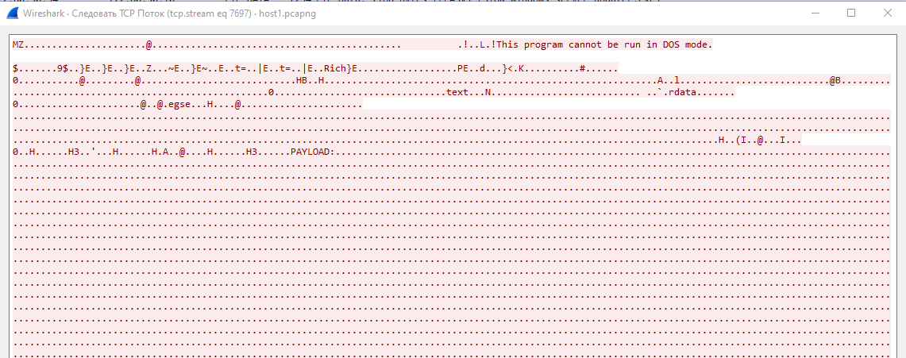

На данный момент лишь понятно, что этот файл является исполняемым для платформ на базе Windows (https://wangrui.wordpress.com/2007/06/19/file-signatures-table/):

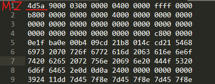

При этом, внутри можно обнаружить слово "***PAYLOAD***", что может указывать на ВПО сгенерированное через ***msfvenom***, но это пока что не дает никаких гарантий на то, что это действительно файл от msfvenom. Нужно смотреть на его поведение, т.е., что с его помощью делал злоумышленник. Либо реверсить :)

Подтверждение наличия файла ***windows_server_updater.exe*** на FTP-сервере:

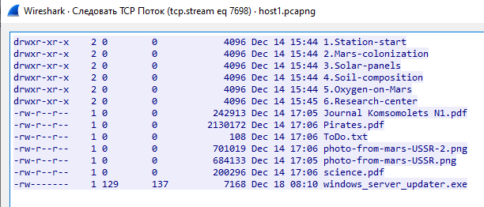

А вот далее происходит более интересная ситуация. Обращаем внимание на поток 7700:

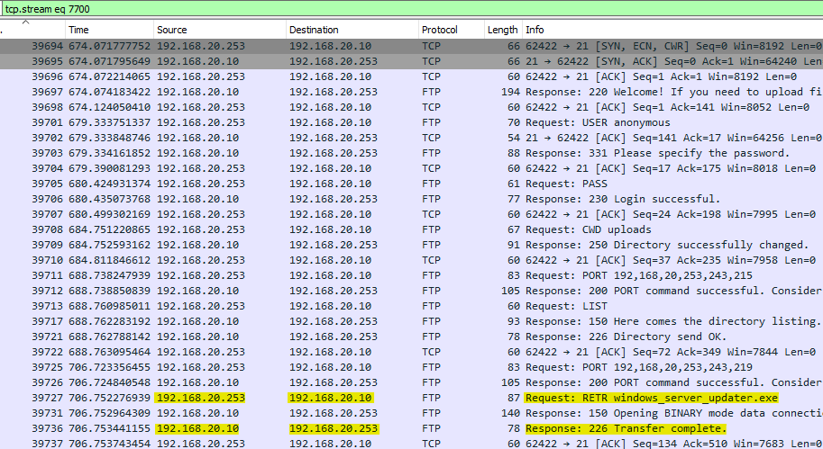


Получается, что с хоста 192.168.20.253 был произведен вход на FTP-сервер (192.168.20.10) с последующей загрузкой ВПО ***windows_server_updater.exe***. 

#### Этап 5. Реализация Reverse Shell

После загрузки жертвой ВПО с FTP-сервера, он, по всей видимости, был запущен. При этом открылось новое сетевое взаимодействие между 192.168.20.10 и 192.168.20.253, которое обозначается в сетевом дампе как ***RTPproxy/TCP***. Достаточно просто просмотреть поток 7703:

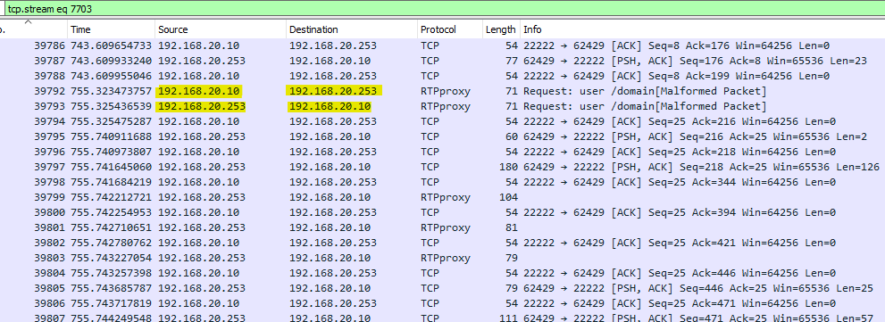

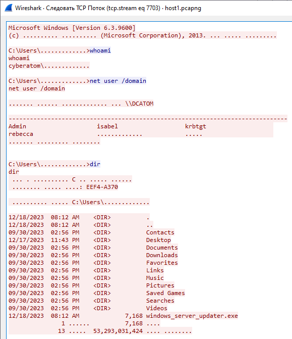

Вот, собственно, из этого же потока можно понять, что злоумышленник нашел логин/пароль от PostgreSQL:

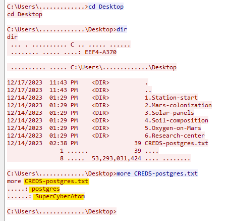

> Данные для входа - postgres:SuperCyberAtom

Если более детально рассмотреть пакеты с RTPproxy, то можно заметить, что трафик идет в сторону 192.168.20.10 на порт 22222. Соответственно, если версия с msfvenom правдоподобна, то в качестве параметра LPORT был бы установлен 22222:

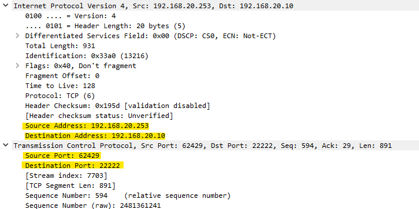

При этом странно, что ВПО было создано на 172.80.50.34, а порт прослушивается на 192.168.20.10. Тут одно из двух - либо атакующий слушал порт 22222 на 192.168.20.10, либо он пробросил себе порт. Пока что на данный момент мы не может точно ответить на данный вопрос.

В конечном итоге злоумышленник входит на PostgreSQL (см. потоки 7705 и 7706):

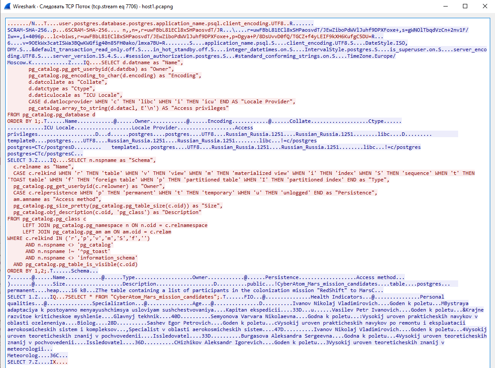

Обращаем внимание на то, что был сделан SQL-запрос со стороны атакующего

```sql
SELECT * FROM "CyberAtom_Mars_mission_candidates";
```

Полученные данные из таблицы:

| FIO | Health | Personal qualities | Specialization | Age | 
| :-: | :----: | :----------------: | :------------: | :-: |
| Ivanov Nikolaj Vladimirovich | Goden k poletu | Bystraya adaptaciya k postoyanno menyayushchimsya usloviyam sushchestvovaniya | Kapitan ekspedicii | 33 |
| Vasilev Petr Ivanovich | Goden k poletu | Krajne razvitoe kriticheskoe myshlenie | Glavnyj tekhnik | 40 |
| Semyonova Varvara Nikolaevna | Godna k poletu | Vysokij uroven prakticheskih navykov v oblasti ozeleneniya | Biolog | 28 |
| Sashev Egor Petrovich | Goden k poletu | Vysokij uroven prakticheskih navykov po remontu i ekspluatacii aerokosmicheskih sistem i kompleksov | Specialist v oblasti aerokosmicheskih sistem | 47 |
| Ivanov Nikolaj Vladimirovich | Goden k poletu | Vysokij uroven teoreticheskih znanij v pochvovedenii | Issledovatel | 33 |
| Burgasova Aleksandra Sergeevna | Godna k poletu | Vysokij uroven teoreticheskih znanij v pochvovedenii | Issledovatel | 36 |
| CHizhikov Aleksandr Igorevich | Goden k poletu | Vysokij uroven teoreticheskih znanij v meteorologii | Meteorolog | 36 | 

Ревью:
1. Неизвестны версии ОС и предназначения хостов;
2. Мы не знаем, каким образом злоумышленник получил доступ по SSH на хост 172.80.50.10;
3. Неизвестно, что происходит по сетевым взаимодействиям между хостами, особенно по части RTPproxy.

---
### Часть 2. Исследование файлов host2.pcapng и host3.pcapng

Исследование файлов host2.pcapng и host3.pcapng показывает следующие шаги:
1. Сканирование подсети 192.168.20.0/24;
2. Взаимодействие с HTTP-сервером;
3. Попытки входа в PostgreSQL;
4. Загрузка ВПО на сервер и его скачивание;
5. Активация ВПО, реализация reverse shell;
6. Получение данных от PostgreSQL;
7. Вход в PostgreSQL, получение данных из основной таблицы.

> Все данные этапы описаны ранее в части 1

---
### Часть 3. Исследование файла host2-dump.raw

Переходим к исследованию дампов оперативной памяти. Для начала определим профиль ОС, используя volatility 2 файла host2-dump.raw:

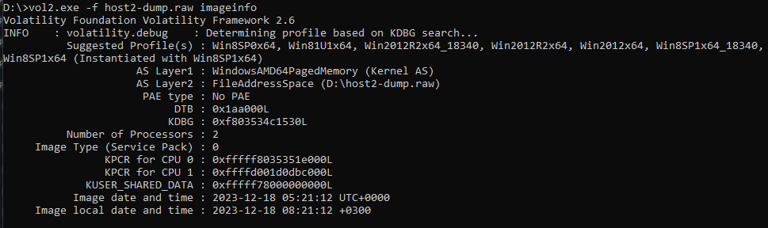

Несмотря на то, что наиболее вероятный вариант указан Win8SP0x64, мы будем использовать профиль ***Win2012R2x64***. Закономерный вопрос - почему? Все просто. Данный хост является контроллером домена, что можно наблюдать по сетевым дампам:

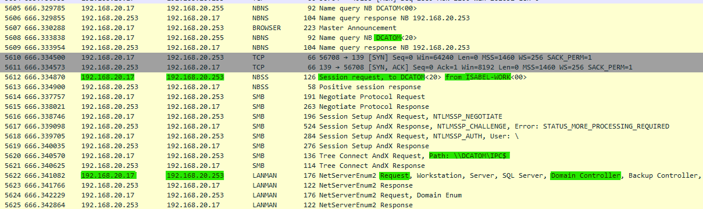

С помощью плагина `pstree` выявляем наличие процесса, вызванного файлом ***windows_server_updater.exe***:

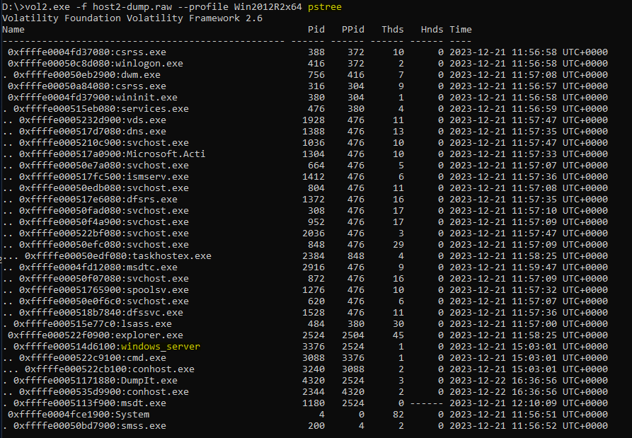

А вот и наличие сетевого соединения, вызванное запуском вышеупомянутого файла:

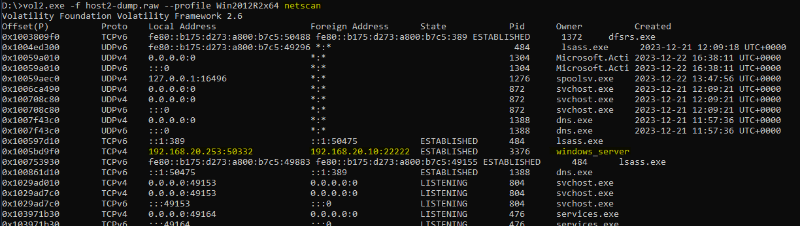

Еще одно подтверждение запуска вредоносного процесса:

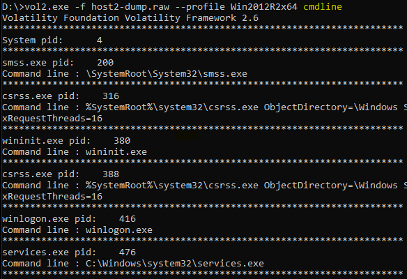

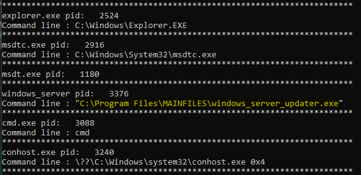

---
### Часть 4. Исследование файлов с логами

Обращаем внимание на то, что в файле ***access.log*** присутствуют записи, которые показывают, что на HTTP-сервер заходил хост с IP-адресом 172.80.50.34 (атакующий). При этом мы помним, что HTTP работает на 80 порте хоста 192.168.20.17.

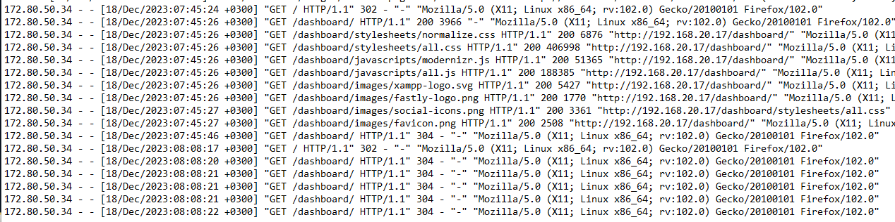

Возникает закономерный вопрос - каким образом атакующий добрался из одной подсети в другую? Этот нюанс мы пока выяснить не можем.

Файл ***postgresql-2023-12-18_000000.log*** содержит в себе логи от PostgreSQL. При этом по записям видно, что кто-то пытался войти несколько раз при помощи пользователя root, но неудачно. Как мы ранее выяснили, это был как раз-таки атакующий.

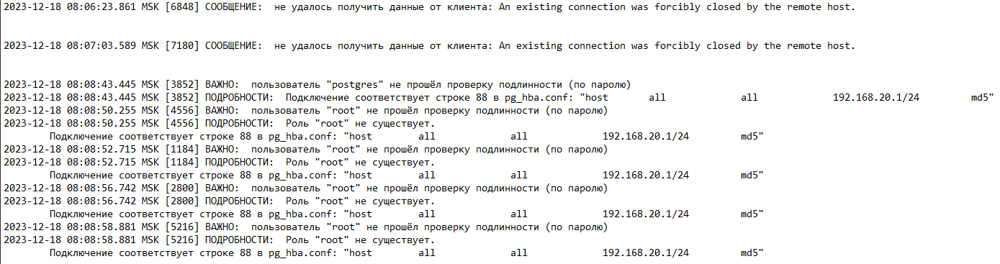

---
### Часть 5. Исследование файла host1-HD.7z

Теперь ответим на 2 самых главных вопроса:
1) Каким образом был получен доступ до хоста 172.80.50.10 по SSH?
2) Мог ли злоумышленник перенаправить себе трафик с Ubuntu 22.04 через проброс портов SSH?

#### Вход на Ubuntu 22.04 через kevin

В файле ***/etc/shadow*** на ***.vmdk*** от Ubuntu 22.04 находим хэш пароля от УЗ kevin:

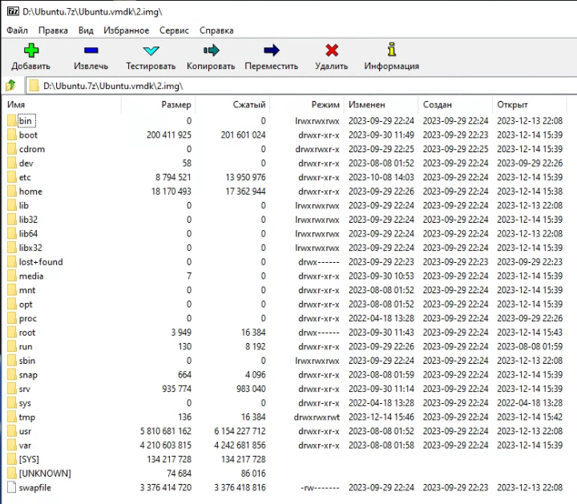

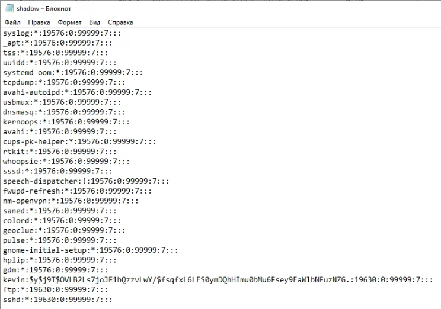

> kevin:\$y\$j9TSOVLB2Ls7joJF1bQzzvLwY/$fsqfxL6LES0ymDQhHImu0bMu6Fsey9EaWlbNFuzNZG.:19630:0:99999:7:::

Получаем пароль - ***gabriela*** из ***rockyou.txt***, поэтому, можно сделать предположение о том, что злоумышленник сбрутил пароль от УЗ kevin (он единственный пользователь на Ubuntu, подключение относительно **root** недоступно).

#### Указание на возможность проброса портов

Для того, чтобы определить, активировал ли злоумышленник какие-либо опции SSH-конфига для дальнейшего проброса портов и создания туннелируемых соединений, необходимо обратиться к файлу ***/etc/ssh/sshd_config*** и посмотреть, активны ли параметры: **GatewayPorts**, **AllowTCPForwarding**

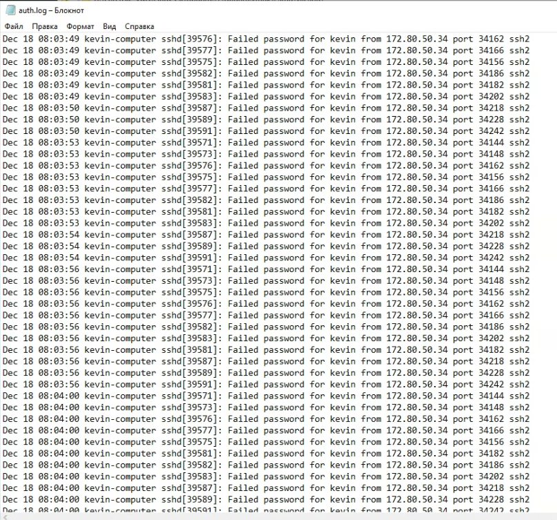

На этом, пожалуй, все!

---
