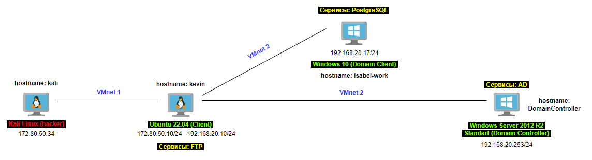

---

***Предисловие***: Данный стенд был подготовлен в рамках мероприятия "***RedShift190***", которое проводил Колледж программирования и Кибербезопасности.

---

***Схема сети***:

---

***Kali Linux***:
- Активный SSH-сервер;
- Активный proxychains (порт 8888).

***Ubuntu 22.04***:
- Активный vsftpd сервер (возможность чтения и записи файлов (local_umask=002) + вход под anonymous);
- Активный SSH-сервер (стандартные параметры);
- Слабый пароль для пользователя kevin;

***Windows Server 2012 R2 Standart***:
- Active Directory - домен - CyberAtom.local;
- Настроена обратная DNS-зона;
- Отключен Брандмауэр;
- На рабочем столе лежат данные для входа на PostgeSQL

***Windows 10***:
- Машина, находящаяся в домене CyberAtom.local;
- Поднята PostgreSQL 15 c базой данных "CyberAtom_Mars_mission_candidates";
- Отключен Брандмауэр;
- Отключен Defender;

---
